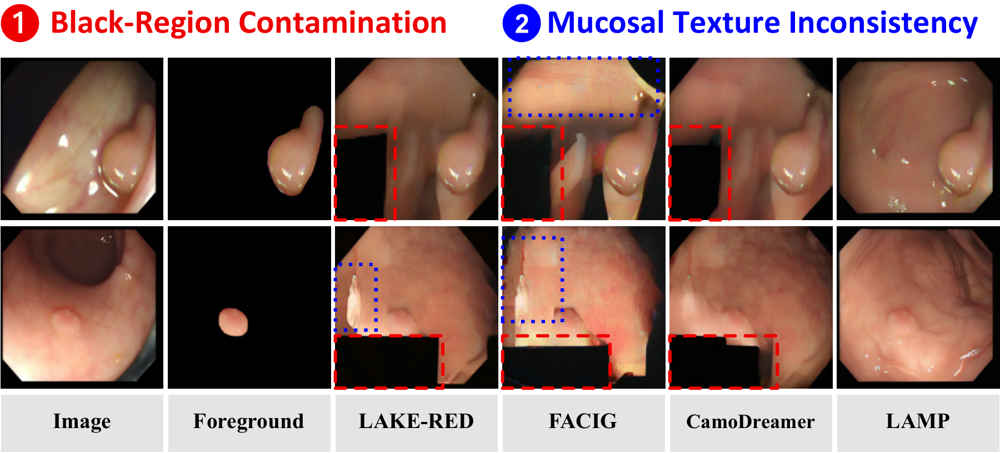
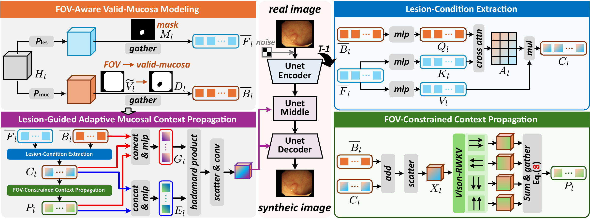
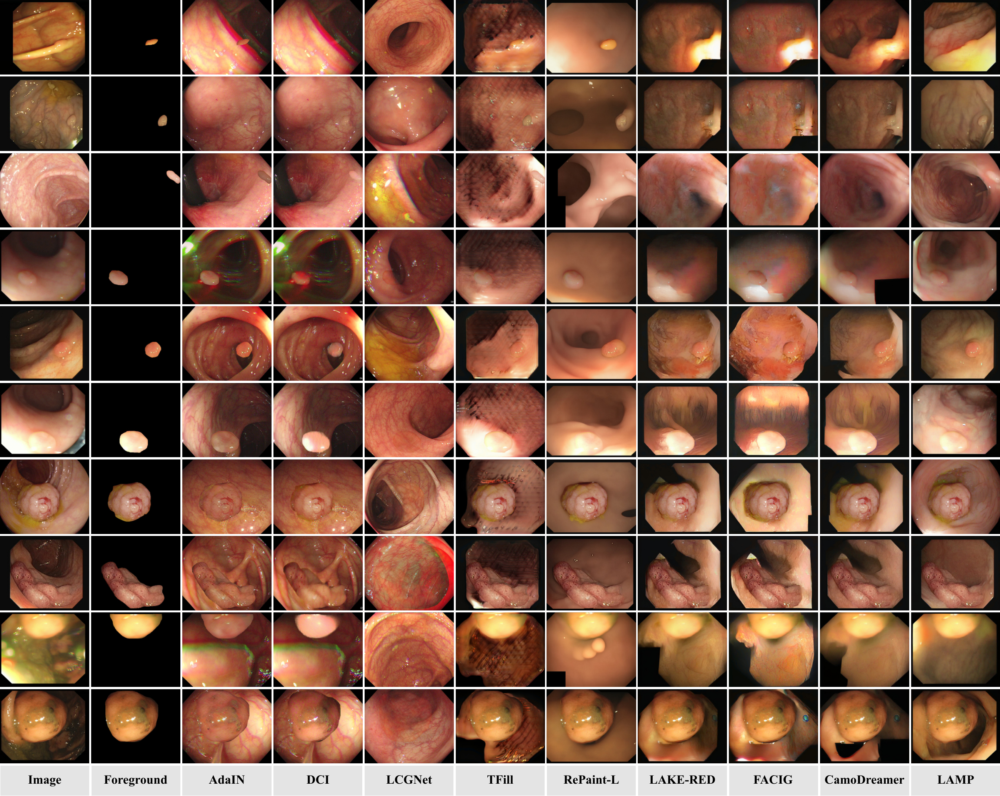
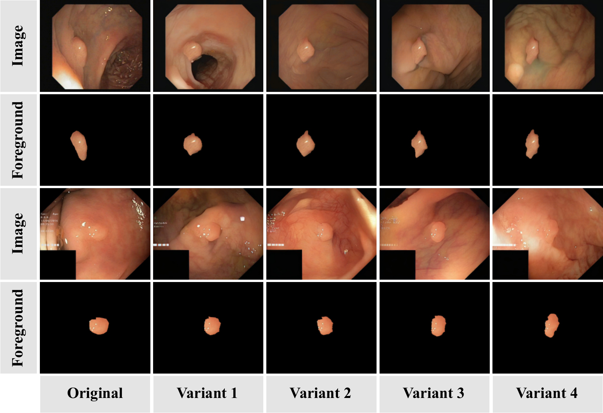

# 💡 LAMP

### Beyond the Foreground: FOV-Aware Polyp Image Synthesis via Lesion-Guided Adaptive Mucosal Context Propagation

**Tong Wang<sup>1,2</sup>, Yuting He<sup>3</sup>, Bin Ren<sup>2</sup>, Yutong Xie<sup>2</sup>, Guanyu Yang<sup>1</sup>**

<sup>1</sup> Southeast University, China<br>
<sup>2</sup> Mohamed bin Zayed University of Artificial Intelligence (MBZUAI), UAE<br>
<sup>3</sup> Case Western Reserve University, USA

[](https://arxiv.org/abs/2609.19966)
[](https://arxiv.org/pdf/2609.19966)
[][checkpoints]

Official repository for **LAMP**, short for **L**esion-Guided **A**daptive **M**ucosal Context **P**ropagation.

**Given a lesion foreground, its mask, and a field-of-view (FOV) mask, LAMP synthesizes compatible mucosal context for polyp image augmentation.**

[Overview](#-overview) · [Framework](#%EF%B8%8F-framework-overview) · [Results](#-experimental-results) · [Downloads](#-download-resources) · [Code](#%EF%B8%8F-code-and-reproducibility) · [Citation](#-citation)

## 📢 News

- **[2026/09]** The paper is available on [arXiv](https://arxiv.org/abs/2609.19966).
- **[2026/09]** The paper is currently under peer review. Source code will be made publicly available at a later stage.

## 📋 Publication and Code Release Status

**The paper is currently under peer review.** This repository provides the paper overview, figures, archived metrics, and checkpoint download links. The source code for training, inference, and evaluation will be made publicly available at a later stage.

## 📌 Overview

Synthetic image and mask pairs can reduce the need for costly colonoscopy annotations. However, realistic synthesis requires maintaining the supplied lesion while generating compatible surrounding tissue. Foreground-guided methods face two particular challenges in colonoscopy: **black-region contamination**, where camera-exterior regions leak into generated tissue, and **mucosal texture inconsistency**, where folds, vessels, and illumination lack coherence.

LAMP explicitly separates the lesion, valid mucosa, and camera exterior. Lesion-to-Mucosa cross-attention extracts lesion-dependent appearance conditions, FOV-constrained multidirectional Vision-RWKV propagates them over valid tissue, and an adaptive gate controls their residual fusion into the diffusion U-Net.

Experiments cover five polyp datasets and five downstream segmentation models. LAMP achieves an overall **FID of 61.02**, **KID of 0.018**, and **Coverage of 0.397** on the 798-image generation benchmark.

<p align="center">
  
</p>

## ✨ Highlights

- **Foreground-guided synthesis.** Uses a supplied lesion foreground and its annotation to guide compatible mucosal generation.
- **FOV-aware modeling.** Separates valid tissue from camera-exterior black regions and constrains contextual reasoning to the valid field of view.
- **Lesion-guided context propagation.** Combines Lesion-to-Mucosa attention, four-direction Vision-RWKV propagation, and adaptive residual fusion.
- **Downstream utility.** Adding 1,000 synthetic image and mask pairs improves average Dice by **1.32 percentage points** across five segmentation models and five test datasets.

## 🏗️ Framework Overview

<p align="center">
  
</p>

1. **FOV-aware valid-mucosa modeling** partitions features into lesion, valid mucosa, and camera-exterior regions.
2. **Lesion-condition extraction** uses mucosal queries and lesion keys/values to obtain location-specific appearance conditions.
3. **FOV-constrained context propagation** distributes these conditions through horizontal and vertical forward/reverse Vision-RWKV scans.
4. **Adaptive residual fusion** writes propagated context into the U-Net middle and decoder blocks during denoising.

## 📊 Experimental Results

### Overall generation quality

Results from Table I of the [paper](https://arxiv.org/abs/2609.19966). Lower FID/KID and higher Coverage are better. **F** denotes the supplied foreground; **B** denotes a selected target background. LAMP additionally uses an FOV mask.

| Method | Input | FID ↓ | KID ↓ | Coverage ↑ |
| :--- | :---: | ---: | ---: | ---: |
| AdaIN | F + B | 104.75 | 0.052 | 0.160 |
| DCI | F + B | 105.05 | 0.046 | 0.149 |
| LCGNet | F + B | 110.84 | 0.052 | 0.160 |
| TFill | F | 173.31 | 0.136 | 0.066 |
| RePaint-L | F | 102.05 | 0.058 | 0.169 |
| LAKE-RED | F | 93.72 | 0.044 | 0.232 |
| FACIG | F | 108.35 | 0.052 | 0.133 |
| CamoDreamer | F | 74.35 | 0.025 | 0.301 |
| **LAMP (Ours)** | **F + FOV** | **61.02** | **0.018** | **0.397** |

Against CamoDreamer, LAMP reduces overall FID by **17.9%** and increases Coverage by **9.6 percentage points**, using the rounded paper values. FACIG and CamoDreamer are reimplementations following their published descriptions, as noted in the paper.

### LAMP results on individual datasets

The following values are rounded from the [archived evaluation CSV](docs/metrics_summary.csv). KID is reported **without multiplying by 100**; Coverage is a fraction. The overall row evaluates all 798 images together and is not an average of the dataset rows.

| Dataset | Images | FID ↓ | KID ↓ | Coverage ↑ |
| :--- | ---: | ---: | ---: | ---: |
| CVC-300 | 60 | 139.33 | 0.049795 | 0.150 |
| CVC-ClinicDB | 62 | 146.96 | 0.036600 | 0.919 |
| CVC-ColonDB | 380 | 78.75 | 0.024389 | 0.329 |
| ETIS-LaribPolypDB | 196 | 114.18 | 0.057352 | 0.168 |
| Kvasir-SEG | 100 | 114.86 | 0.026689 | 0.970 |
| **IPS-overall** | **798** | **61.02** | **0.017545** | **0.397** |

### Qualitative comparison

<p align="center">
  
</p>

The first two columns show the original image and supplied foreground. The remaining columns compare generated images across methods, including LAMP in the last column.

### Diverse foregrounds and compatible mucosa

<p align="center">
  
</p>

For downstream augmentation, an external Atlas-SVF operator jointly deforms the lesion foreground and mask. LAMP then generates compatible mucosa for each variant. **Foreground deformation is an external augmentation step**, rather than a component of LAMP.

### Downstream polyp segmentation

Each cell reports **Dice without → with LAMP augmentation**, using the same 1,000 synthetic image and mask pairs. Values are on a 0–1 scale and come from Table IV of the paper.

| Test dataset | PraNet | SEPNet | STDDNet | CMSA-Net | ARTEMIS |
| :--- | :---: | :---: | :---: | :---: | :---: |
| CVC-300 | 0.871 → 0.877 | 0.899 → 0.905 | 0.884 → 0.895 | 0.897 → 0.897 | 0.896 → 0.909 |
| CVC-ClinicDB | 0.899 → 0.906 | 0.933 → 0.937 | 0.920 → 0.932 | 0.933 → 0.940 | 0.932 → 0.933 |
| CVC-ColonDB | 0.712 → 0.777 | 0.819 → 0.834 | 0.814 → 0.816 | 0.810 → 0.811 | 0.824 → 0.839 |
| ETIS-LaribPolypDB | 0.628 → 0.686 | 0.795 → 0.811 | 0.765 → 0.810 | 0.795 → 0.813 | 0.804 → 0.808 |
| Kvasir-SEG | 0.898 → 0.900 | 0.911 → 0.922 | 0.915 → 0.912 | 0.909 → 0.919 | 0.916 → 0.921 |

Across the 25 model–dataset combinations, average Dice and IoU improve by **1.32** and **1.44 percentage points**, respectively. Improvements are strongest on CVC-ColonDB and ETIS; individual results can remain unchanged or decrease, as shown above. See the paper for all six segmentation metrics.

## 📂 Download Resources

### Model checkpoints

**[Download checkpoints from OneDrive][checkpoints]**. Both files are in the same folder; select the filename below when downloading. The link allows viewing and downloading without editing the files.

| Resource | Filename | Size | Link |
| :--- | :--- | ---: | :---: |
| LAMP model checkpoint | `lamp_best_valid.ckpt` | 6.44 GB | [OneDrive][checkpoints] |
| Training initialization | `lamp_init.ckpt` | 3.31 GB | [OneDrive][checkpoints] |

The model checkpoint corresponds to the archived generation results above and includes EMA state. The initialization checkpoint is used to start training; it is not the trained LAMP model. Sizes use decimal GB.

<details>
<summary><b>Checkpoint SHA-256 checksums</b></summary>

Checksums recorded in the archived resource manifest:

```text
7a9dcfcedb425f6fc02f0dc23794db0f62606b84e07d457f4bf91416820dafeb  lamp_best_valid.ckpt
b1effcdde79db06e6bc966bac81537215e2f62f07a65b593904198b46b269768  lamp_init.ckpt
```

</details>

### Evaluation records

The [archived evaluation CSV](docs/metrics_summary.csv) provides FID, KID, Density, Coverage, Precision, and Recall for each dataset and the pooled benchmark. Public download links for the generated-image and evaluation-input packages will be added with the corresponding release.

## 🛠️ Code and Reproducibility

- [x] Paper and repository documentation
- [x] Framework and qualitative figures
- [x] Model and initialization checkpoints
- [x] Archived evaluation metrics
- [ ] Packaged training, inference, and evaluation code
- [ ] Generated-image and evaluation-input download packages

The archived inference configuration uses **EMA weights**, **50 DDIM steps**, **512 × 512** resolution, **batch size 4**, and fixed per-sample noise seeds for the 798-image manifest. Generation metrics use **torch-fidelity InceptionV3 2048D** features; PRDC uses **k = 5** and the evaluation seed is **2020**. The evaluated images are raw decoder outputs.

The archived environment specifies Linux, Python 3.10, PyTorch 2.5.1 with CUDA 12.1, and PyTorch Lightning 1.9.5. Installation and runnable commands will be published alongside the code after the release package is checked.

## 📖 Citation

If you find LAMP useful in your research, please consider citing:

```bibtex
@article{wang2026lamp,
  title={Beyond the Foreground: {FOV}-Aware Polyp Image Synthesis via Lesion-Guided Adaptive Mucosal Context Propagation},
  author={Wang, Tong and He, Yuting and Ren, Bin and Xie, Yutong and Yang, Guanyu},
  journal={arXiv preprint arXiv:2609.19966},
  year={2026},
  doi={10.48550/arXiv.2609.19966},
  url={https://arxiv.org/abs/2609.19966}
}
```

## 🔗 Related Projects

- [CMSA-Net](https://github.com/wangtong627/CMSA-Net): causal multi-scale aggregation for video polyp segmentation.
- [ARTEMIS](https://github.com/wangtong627/ARTEMIS): imperfectly supervised video polyp segmentation with reliability-aware temporal mask evolution.

For questions or reproducibility discussions, please open a [GitHub issue](https://github.com/wangtong627/LAMP/issues).

[checkpoints]: https://mbzuaiac-my.sharepoint.com/:f:/g/personal/tong_wang_mbzuai_ac_ae/IgBcda8dv7UYRKUlKDb7yj5LARrVQRX3HUiQeq0zXSZJV40
